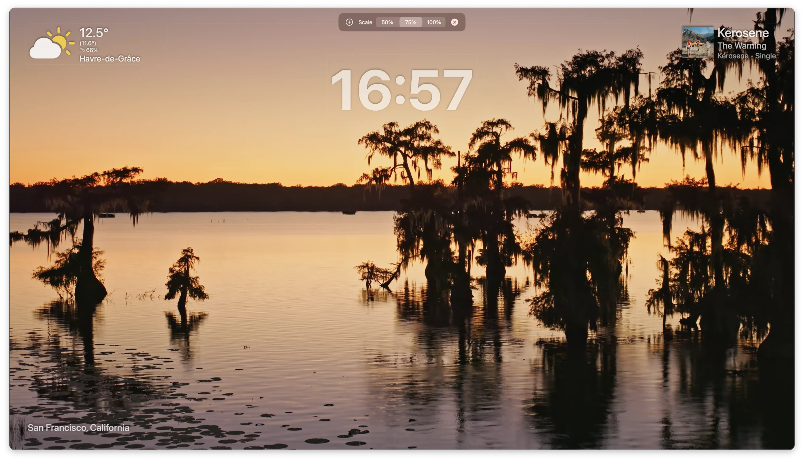

# Aerial

[](https://github.com/AerialScreensaver/Aerial/releases) [](https://github.com/AerialScreensaver/Aerial/releases/latest)



The macOS screensaver and video wallpaper app — Apple's aerial videos and a growing community catalog of high-quality footage, with optional overlays, time-of-day adaptation, and live camera feeds.

Website: [aerialscreensaver.github.io](https://aerialscreensaver.github.io)

## Requirements

- macOS 15 (Sequoia) or later.
- Xcode 16 or later to build from source.

## Build from source

```bash
git clone https://github.com/AerialScreensaver/Aerial.git
cd Aerial
open Aerial.xcodeproj
```

In Xcode, pick the **Aerial** scheme and build (`⌘B`) or run (`⌘R`).

### Weather overlay (optional)

`ScreenSaver/Source/Models/API/APISecrets.swift` ships with a blank OpenWeather key in the public source. The weather overlay won't display data unless you put your own free key there — get one at [openweathermap.org](https://openweathermap.org). Everything else in the app works without it.

## Contributing

Pull requests welcome. Please open an issue first for substantial changes so we can discuss the approach before you put time into it.

## License

MIT — see [LICENSE](LICENSE).
